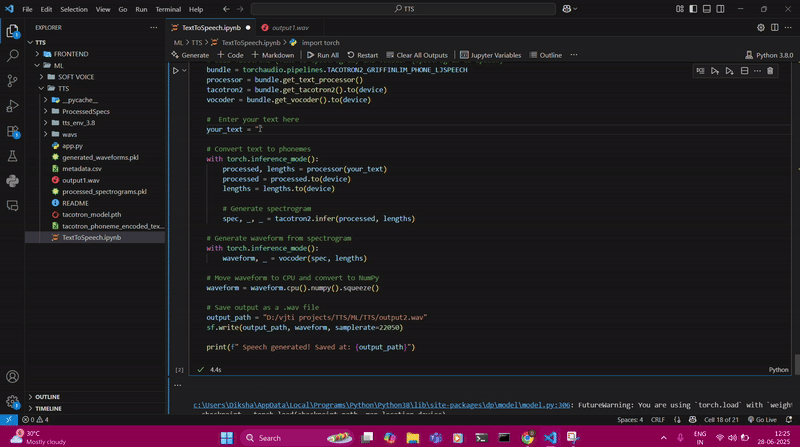

# 🎙️ Text-to-Speech System  
*A Deep Learning-Based Speech Synthesis Project*

---

## 📌 Overview

This project implements a **deep learning-based Text-to-Speech (TTS)** system that converts written English text into human-like speech.

In many accessibility-driven or voice-based applications—such as screen readers, voice assistants, and audiobooks—generating expressive and intelligible speech is essential. Traditional TTS systems often sound robotic or require complex vocoding pipelines.

This solution leverages **Tacotron 2**, a state-of-the-art sequence-to-sequence model with attention, along with the **Griffin-Lim vocoder** to synthesize speech from raw text. Despite its simplicity, the model generates clear and comprehensible audio, making it ideal for lightweight and educational applications.

---

## ✨ Features

- **Text-to-Speech Conversion**  
  Converts plain English text into speech using a deep learning pipeline.

- **Tacotron 2 Architecture**  
  Uses an attention-based encoder-decoder network to generate mel-spectrograms from textual input.

- **Griffin-Lim Vocoder**  
  Synthesizes waveforms from mel-spectrograms using the Griffin-Lim algorithm.

- **Training on LJSpeech Dataset**  
  Fine-tuned using the LJSpeech dataset with 13,100 text–audio pairs for high-quality synthesis.

- **Custom Inference Script**  
  Supports easy inference—users can input text and generate corresponding `.wav` audio.

- **Spectrogram & Attention Visualization**  
  Produces alignment plots and mel-spectrograms to monitor training and inference performance.

---

## 🎥 Demo Preview





---

## 🔗 Links & Media

- **📁 GitHub Repository:**  
  [github.com/dikshat25/TextToSpeech](https://github.com/dikshat25/TextToSpeech)

- **📹 Demo Video:**  
  [Watch Full Demo](https://drive.google.com/drive/folders/1McUQXxP120t8BJnxS44jETvi8mOjdFV7?usp=sharing)

- **🖼️ Screenshot Gallery:**  
  [View Screenshots](https://drive.google.com/drive/folders/1y28jZ52TOIYmaxa05FmxBWcbdiKuv-Fv?usp=sharing)

---

## 🤖 Tech Stack

| Category         | Tools / Libraries                          |
|------------------|---------------------------------------------|
| **Language**     | Python                                      |
| **Deep Learning**| PyTorch                                     |
| **Model**        | Tacotron 2                                  |
| **Vocoder**      | Griffin-Lim Algorithm                       |
| **Libraries**    | NumPy, Librosa, Matplotlib                  |
| **Dataset**      | LJSpeech (13,100 English audio-text pairs)  |

---

## 🚀 Future Scope

- Replace **Griffin-Lim** with advanced neural vocoders like **WaveGlow** or **HiFi-GAN** for more natural speech.
- Add **multilingual support** (e.g., Hindi, Marathi) to expand real-world use.
- Explore **speaker conditioning** to support multiple voice profiles.
- Build a **Streamlit-based frontend** to allow real-time input and audio playback through a web UI.

---

## 🛠 Setup Instructions

### Requirements
- Python 3.8+
- GPU with CUDA (recommended for training)
- `pip install -r requirements.txt` (include libraries like PyTorch, Librosa, NumPy, Matplotlib, etc.)

### Steps
1. Clone the repository  
   `git clone https://github.com/dikshat25/TextToSpeech`

2. Download the LJSpeech dataset and place it in the appropriate directory.

3. Train the model (or skip this step if using pretrained weights).

4. Run inference using the sample script:
   ```bash
   python inference.py --text "Hello, how are you doing today?"
